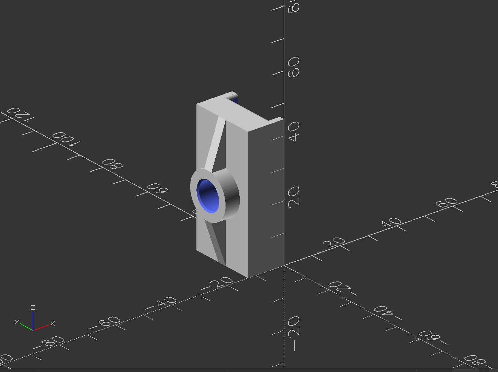
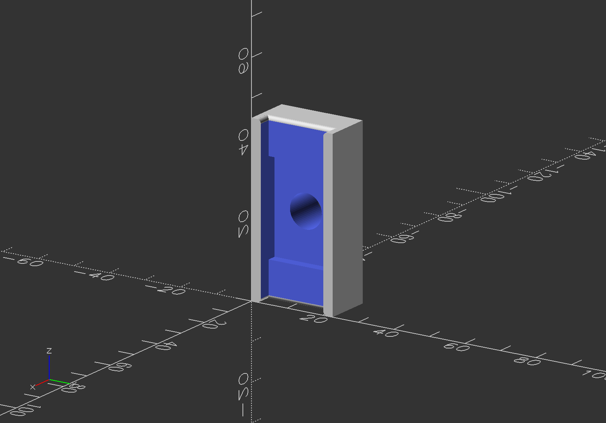

# Elevator Door Slider / Hinge

Elevator door replacement part. Modelled parametrically in [OpenSCAD](https://openscad.org/).

## Links

- **[Download in MakerWorld] TODO**
- **[Download in Printables] TODO**

## Main Block Dimensions

- **Length:** ~45 mm
- **Width:** ~22.5mm
- **Height:** ~12.5mm

## Assembly

⚠️ **MUST BE FITTED WITH AN M8x1x12mm HEAT INSERT**

## License

This work is licensed under **CC BY-SA 4.0** (Attribution–ShareAlike):

- **Attribution** — you must give appropriate credit.
- **ShareAlike** — if you remix or build upon it, you must distribute your
  contributions under the same license.

See the [`LICENSE`](../LICENSE) at the root of the repo for details.
